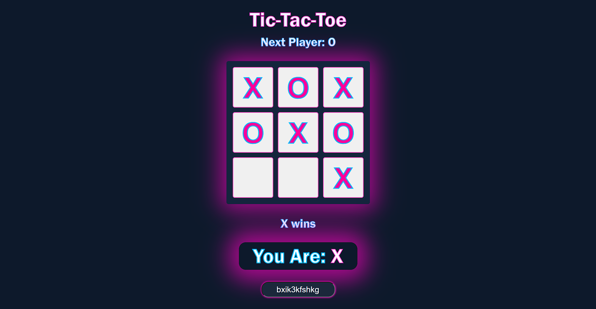

# Multiplayer TicTacToe
## Deployed here: https://tic-tac-toe-multiplay.netlify.app/

## Backend: https://tic-tac-toe-servr.herokuapp.com/
## Backend Repo: https://github.com/AhindraD/Tic-Tac-Toe-Backend

Make a multiplayer TicTacToe which can be played over internet (using websockets).

## Frontend
 
You can reuse the TicTacToe React Project with some modifications.

- The main page of the game will contain two buttons, `Join a room` or `Create a new Room`
  - Player clicks on Create a new room, which sends a request to the websocket server and gets a room id (random string) from the server

  - Player can then share this room id with other player so the can click `Join a room` and enter that room id.

  - While the second player is joining the room the first player will see a message `Waiting for opponent`, and this player will be assigned `X`
   
  
  - When second player joins the room, the status changes to `X's turn` for both player, and then the game continues normally

